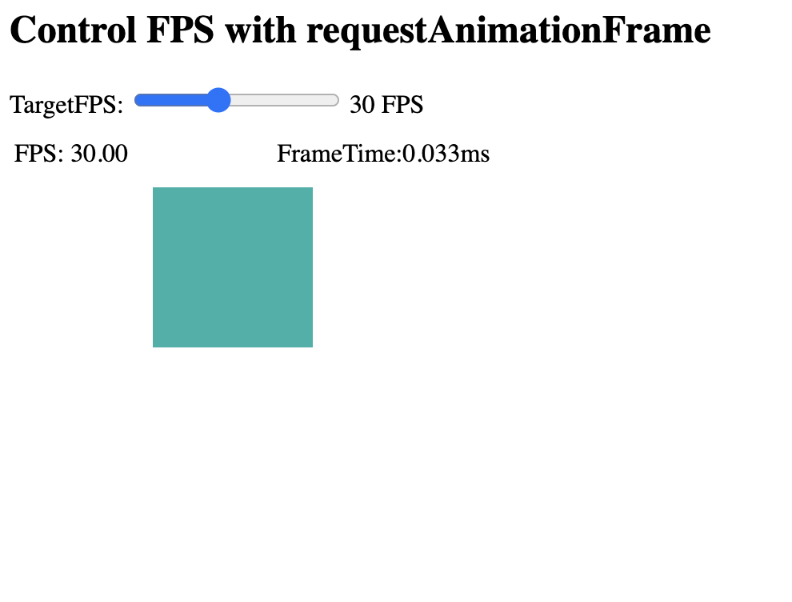

### Control FPS with requestAnimationFrame

EXAMPLE: 
https://markustieche.github.io/Control-FPS-with-requestAnimationFrame/

The frequency of calls to the callback function will generally match the display refresh rate. The most common refresh rate is 60hz, (60 cycles/frames per second), though 75hz, 120hz, and 144hz are also widely used. requestAnimationFrame() calls are paused in most browsers when running in background tabs or hidden "iframe", in order to improve performance and battery life.

https://developer.mozilla.org/en-US/docs/Web/API/window/requestAnimationFrame

## Why it's important to control FPS 
For the best possible user experience it's important to keep track of your "FPS"(Frames per Second) and your "dt"(Delta-time between frames). You can not control the refesh rate of a Users display but you can and should control the FPS. 
Uncontrolled FPS can result in jaggy and jittery animations.

Physics and Animations do not have to be calculated on the same Frame. While updating animations at 60 FPS you can calculate Physics/Collisions at a lower Framerate or vice versa depending on the situation. This will drasticly improve the overall performance of your Application. 